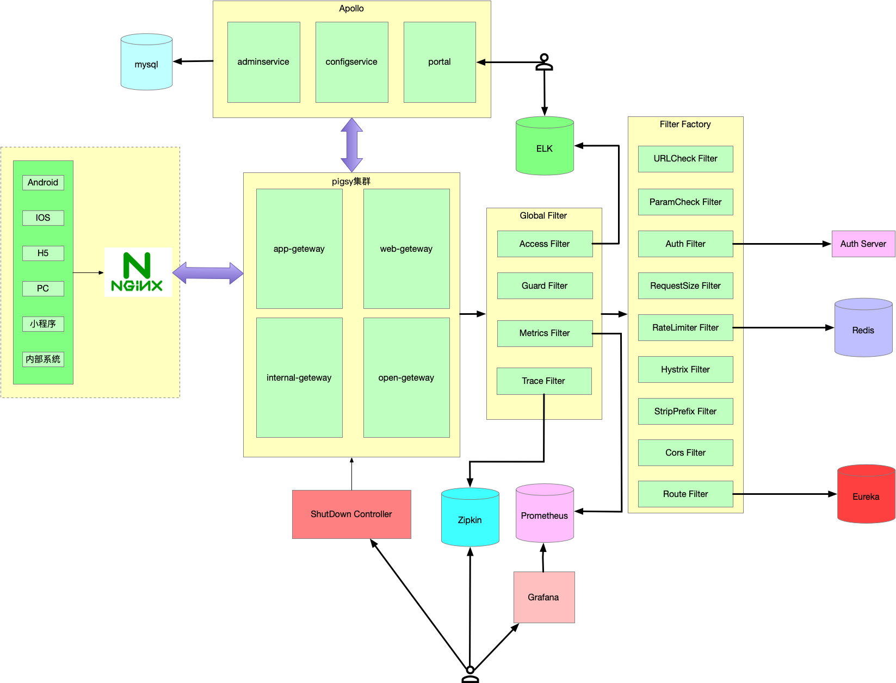

# *背景*
惠农网之前的网关是基于zuul来进行开发的，zuul在市场上逐步被gateway所代替，异步模型更好的支持高并发场景，在替换的同时解决了一些遗留问题。

# *架构*


# *依赖*

- `Spring-Boot`的`2.3.9.RELEASE`版本
- `Spring-Cloud`的`Hoxton.SR10`版本
- `Apollo`的`1.8.1`版本
- `Sentry`的`21.3.0`版本
- `Redis`的`5.0.8`版本

# *模块*

- `pigsy-gateway-eureka` 提供了核心的服务注册和发现功能，网关通过先从`eureka`模块获取数据，然后进行路由选择到具体的服务
- `pigsy-gateway-apollo` 提供了配置中心功能，网关通过先从`apollo`模块实时获取配置数据，并且进行动态更新
- `pigsy-gateway-auth` 提供了各种环境的权限认证的方式，可能认证要处理不同的业务逻辑，故独立成独立服务进行验证，把认证结果告知网关
- `pigsy-gateway-sentry` 提供了错误的报警和统计展示功能
- `pigsy-gateway-redis` 提供了缓存的功能
- `pigsy-gateway-core` 提供了网关的4个模块的核心功能
- `pigsy-gateway-common` 提供了一些公共的基础类和基础方法，方便整个项目进行使用


# *功能结构图*


# *过滤器功能特点*

### *全局过滤器*

- `CorsFilter` 这个全局过滤器在网关层面提供了统一的跨域能力。
  另外补充遇到的一个坑：由于可能部分后端服务单独设置了跨域的头，
  所以在配置这个跨域过滤器的时候，要加入对应的`DedupeResponseHeader`参数来解决这个问题
- `GuardFilter` 这个全局过滤器给网关提供了部分保护能力。
  主要包括（ip黑名单、对应部分服务停机、对应部分接口停机、header黑名单等功能）
- `AccessLogFilter` 这个全局过滤器用于记录每次请求访问的部分关键参数。
  同时对于错误请求以及慢请求则打印更加详细的信息

### *普通过滤器*

- `ApiGatewayFilterFactory` 这个过滤器用于判断所访问的接口是否是对外接口，如果非对外接口则直接返回`404`状态


# *关于*

# *License*

```
Copyright 2014-2021 Hunan Huinong Technology Co.,Ltd.

Licensed under the Apache License, Version 2.0 (the "License");
you may not use this file except in compliance with the License.
You may obtain a copy of the License at

   https://www.apache.org/licenses/LICENSE-2.0

Unless required by applicable law or agreed to in writing, software
distributed under the License is distributed on an "AS IS" BASIS,
WITHOUT WARRANTIES OR CONDITIONS OF ANY KIND, either express or implied.
See the License for the specific language governing permissions and
limitations under the License.
```
